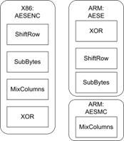
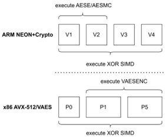
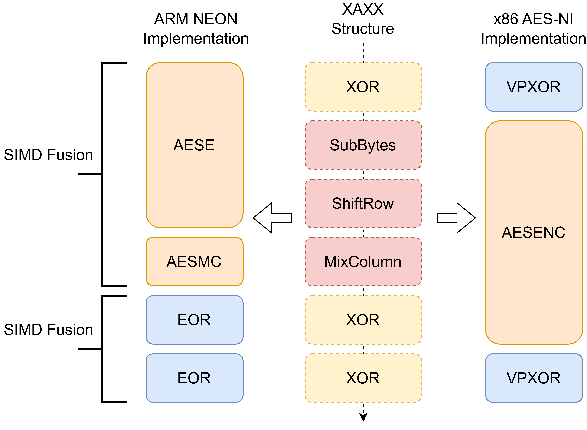
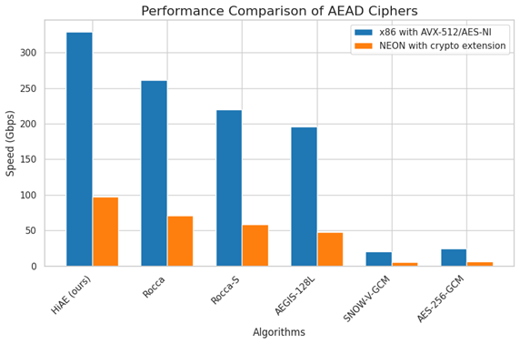

# HiAE
Official implementation of paper "HiAE: A High-Throughput Authenticated Encryption Algorithm for Cross-Platform Efficiency"

## Design Rational

The HiAE is an AES-based AEAD cipher that mainly focuses on cross-platform efficiency(ARM and x86) and achieves the fastest speed on the latest ARM and x86 architectures.

#### AES round function instructions' difference between ARM and x86

#### Pipeline Difference of the Latest ARM and x86 Architectures

#### XAXX Structure

## Speed Benchmark

