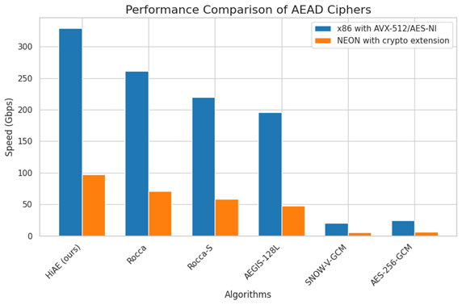

## HiAE: A High-Throughput Authenticated Encryption Algorithm for Cross-Platform Efficiency

Official implementation of paper "[HiAE: A High-Throughput Authenticated Encryption Algorithm for Cross-Platform Efficiency](https://eprint.iacr.org/2025/377)"

## Design Rational

The HiAE is an AES-based AEAD cipher that mainly focuses on cross-platform efficiency(ARM and x86) and achieves the fastest speed on the latest ARM and x86 architectures.

#### XAXX Structure


## Speed Benchmark

View the full speed benchmark [here](https://concyclics.github.io/HiAE/Speed/speed.html)



## Applications

#### File AEAD Encryption & Decryption

The File encryption will auto append the AEAD tag after the file for integrity protection.

**compile**
```bash
#For x86
gcc -O3 -march=native -I code/ code/HiAE.c app/file_enc.c -o FileHiAE
#For armv8
gcc -O3 -march=armv8-a+crypto -I code/ code/HiAE.c app/file_enc.c -o FileHiAE
```

**Usage**
```bash
./FileHiAE <encrypt/decrypt> <input_file> <output_file> <key: 32 chars> <iv: 16 chars> [buffer_size: Default 65536]
```

## Acknowledgements

I would like to extend my heartfelt thanks to the following individuals for their assistance in testing the performance data:

- [XIE Wenzheng @ SCUT](https://github.com/albertxwz)
- [ZHANG Tianle @ SCUT](mailto:terryjoy0111@gmail.com)
- [ZHU Di @ SYSU](mailto:zhud29@mail3.sysu.edu.cn)
- [YE Fengwei @ SYSU](https://github.com/ATYXXA)
- [ZHENG Haowen @ NCTU](https://github.com/IslandCreatureCTU)
- [FU Ze @ BIT](https://github.com/Endericedragon)
- [SU Changran @ NJU](mailto:2113848254@qq.com)

Their contributions were crucial in ensuring the scalability of HiAE across various platforms.

## Cite This Work

```
@misc{HiAE,
      author = {Han Chen and Tao Huang and Phuong Pham and Shuang Wu},
      title = {HiAE: A High-Throughput Authenticated Encryption Algorithm for Cross-Platform Efficiency},
      howpublished = {Cryptology {ePrint} Archive, Paper 2025/377},
      year = {2025},
      url = {https://eprint.iacr.org/2025/377}
}
```

