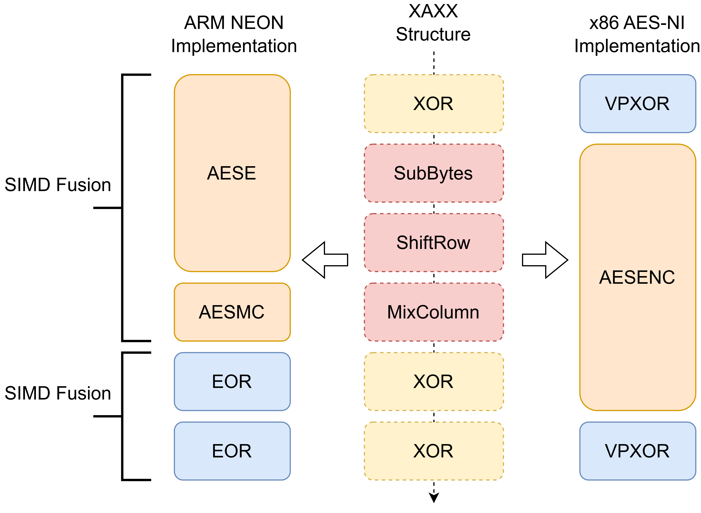
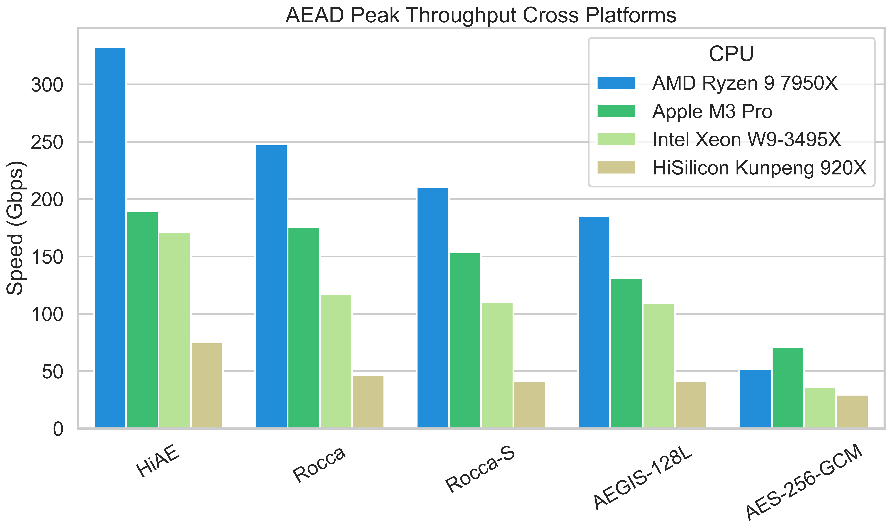

## HiAE: A High-Throughput Authenticated Encryption Algorithm for Cross-Platform Efficiency

Official implementation of paper "[HiAE: A High-Throughput Authenticated Encryption Algorithm for Cross-Platform Efficiency](https://eprint.iacr.org/2025/377)"

## News

* [2025/07/09] A response to recent  Cryptanalysis on HiAE: [HiAE Remains Secure in Its Intended Model: A Clarification of Claimed Attacks](https://eprint.iacr.org/2025/1235.pdf)

## Design Rational

The HiAE is an AES-based AEAD cipher that mainly focuses on cross-platform efficiency(ARM and x86) and achieves the fastest speed on the latest ARM and x86 architectures.

#### XAXX Structure



## Speed Benchmark

View the full speed benchmark [here](https://concyclics.github.io/HiAE/Speed/speed.html)



#### Bench HiAE on your machine

```bash
gcc -O3 -march=native -I code code/*.c test/performance_test.c -o perf_test
./perf_test
```

## Applications

#### HiAE-HMAC

The File verification with HiAE MAC mode.

**compile**

```bash
gcc -O3 -march=native -I code code/*.c app/HiAE-MAC.c -o HiAE-MAC
```

**Usage**

```bash
./HiAE-MAC <input_file> <key> <iv> [buffer_size (MB)]
```

**Example**

```bash
$ ./HiAE-MAC README.md 1926 0817
KEY = 1926000000000000000000000000000000000000000000000000000000000000
IV = 08170000000000000000000000000000
MAC: c9e1326675a5e70c3609c8eacfe89b83
MAC file README.md (2079 bytes) in 0.000100 seconds
Speed: 0.019362 GB/s
```

#### File AEAD Encryption & Decryption

The File encryption will auto append the AEAD tag after the file for integrity protection.

**compile**

```bash
gcc -O3 -march=native -I code code/*.c app/HiAE-File-AEAD.c -o HiAE-File-AEAD
```

**Usage**

```bash
./HiAE-File-AEAD <encrypt/decrypt> <input_file> <output_file> <key> <iv> [buffer_size (MB)]
```

**Example**

```bash
$ ./HiAE-File-AEAD encrypt README.md README.enc 1926 0817
KEY = 1926000000000000000000000000000000000000000000000000000000000000
IV = 08170000000000000000000000000000
Encrypted README.md to README.enc (2079 bytes) in 0.000178 seconds
Speed: 0.010878 GB/s

$ ./HiAE-File-AEAD decrypt README.enc README.md 1926 0817
KEY = 1926000000000000000000000000000000000000000000000000000000000000
IV = 08170000000000000000000000000000
Authorization Passed.
Decrypted README.enc to README.md (2079 bytes) in 0.000220 seconds
Speed: 0.008801 GB/s 
```

## Acknowledgements

I would like to extend my heartfelt thanks to the following individuals for their assistance in testing the performance data:

- [XIE Wenzheng @ SCUT](https://github.com/albertxwz)
- [ZHANG Tianle @ SCUT](mailto:terryjoy0111@gmail.com)
- [ZHU Di @ SYSU](mailto:zhud29@mail3.sysu.edu.cn)
- [YE Fengwei @ SYSU](https://github.com/ATYXXA)
- [ZHENG Haowen @ NCKU](https://github.com/IslandCreatureCTU)
- [FU Ze @ BIT](https://github.com/Endericedragon)
- [SU Changran @ NJU](mailto:2113848254@qq.com)

Their contributions were crucial in ensuring the scalability of HiAE across various platforms.

## Cite This Work

```
@misc{HiAE,
      author = {Han Chen and Tao Huang and Phuong Pham and Shuang Wu},
      title = {HiAE: A High-Throughput Authenticated Encryption Algorithm for Cross-Platform Efficiency},
      howpublished = {Cryptology {ePrint} Archive, Paper 2025/377},
      year = {2025},
      url = {https://eprint.iacr.org/2025/377}
}
```
